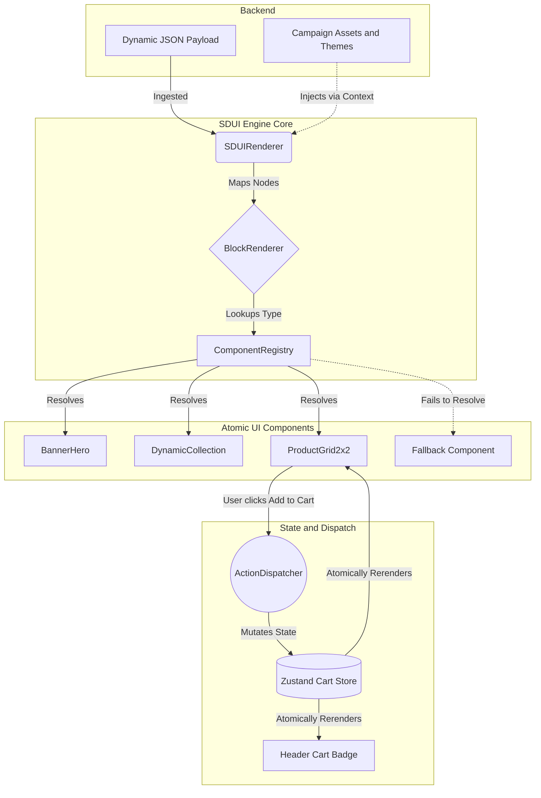

# Kiddo Q-Commerce SDUI Engine

Live Interactive Demo: [kiddo-assignment-6zkxj9y72-sarthak-pals-projects-bd49c908.vercel.app](https://kiddo-assignment-6zkxj9y72-sarthak-pals-projects-bd49c908.vercel.app/)

Note: The live demo is a web-compiled PWA of the React Native engine, artificially constrained to mobile viewport bounds for presentation. Please review the codebase for strict native optimizations (like @shopify/flash-list).

## Overview

This project is a highly performant, production-ready, configuration-driven Server-Driven UI (SDUI) renderer built in React Native. 

It was architected specifically for high-velocity Q-Commerce platforms like Kiddo that require instant layout overhauls, flash sales, and live campaign injections without forcing users to update the app via the App Store or Play Store.

## Core Architectural Decisions

### 1. Server-Driven UI (Factory Pattern)
The frontend acts entirely as a "dumb" client. It parses a deeply nested JSON schema and dynamically mounts UI components via a scalable ComponentRegistry. Hardcoded layouts do not exist in the vertical feed.

### 2. High Frame-Rate Rendering
To satisfy enterprise performance metrics, the engine leverages @shopify/flash-list instead of standard ScrollView or FlatList. Layout nodes are efficiently recycled using strict getItemType mappings and estimatedItemSize definitions, guaranteeing 60FPS scrolling even on low-end Android devices.

### 3. Local State Collocation (Zustand)
Global states (like Cart Increment Counters) completely bypass standard React context tree re-renders. Clicking ADD_TO_CART triggers an atomic subscription update via Zustand, instantly updating the Product Card button and the Cart Badge without stalling the other layout blocks.

### 4. Defensive Resilience (Graceful Degradation)
If a backend microservice pushes an unmapped or corrupted component (e.g., NEW_COMPONENT_V2), the BlockRenderer safely catches the error via React Error Boundaries and gracefully degrades the UI block, preserving total view tree stability.

## System Architecture Diagram



## Live Campaigns Implemented

The architecture dynamically handles Over-The-Air (OTA) theme switching and overlay mounting. Three campaigns are fully mocked:

1. Back to School: Bright yellow and blue palette, paper airplane Lottie overlays, and lunchbox features.
2. Summer Playhouse: Ocean blue theming, water splash interactions, and outdoor toys.
3. Mystery Gift Carnival: Intense carnival red theming, full screen confetti bursts, and dynamic Mystery Box targets.

## Running Locally

To run the React Native bare engine on your local iOS or Android simulator:

```bash
npm install
npx expo start
```
